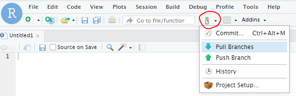
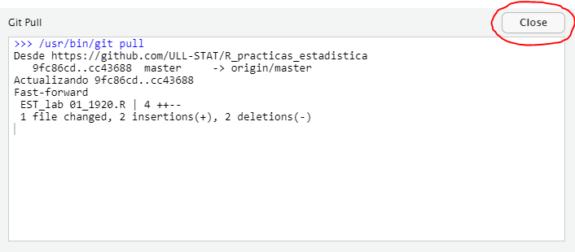

# Prácticas de Estadística (Grado en Matemáticas)

POR FAVOR, NO HAY QUE BORRAR EL ARCHIVO _R_practicas_estadistica.Rproj_ NI RENOMBRAR EL DIRECTORIO _R_practicas_estadistica_.

En  cada práctica de la asignatura se deberá ir al menú __Version control__ y hacer click en __Pull branches__. 

Una vez que se haga la importación hacer click en __Close__.

